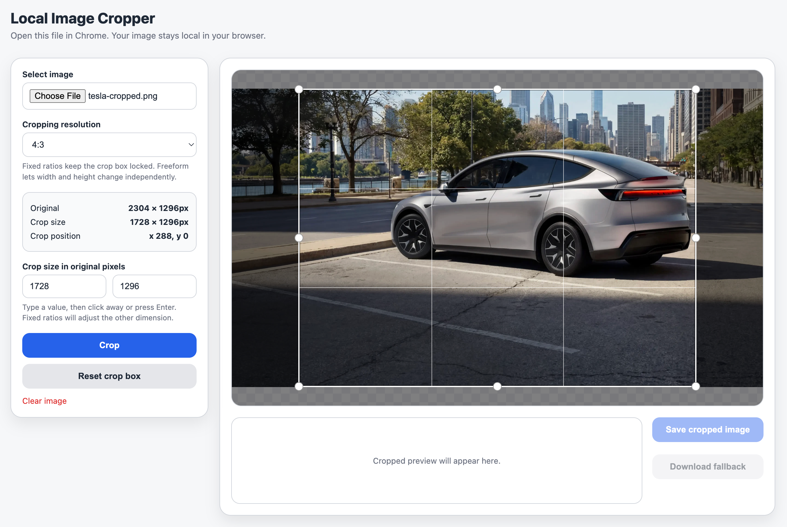

# local-image-cropper
Local image cropper that lives inside your browser. 

## What is it for?

No external websites. Runs locally. Good for sensitive files that you don't want living on the internet. 

## Screenshots

  

## Features

- Choose from pre-defined aspect ratios (1:1, 16:9, 9:16) or user defined sizes
- Drag & expand cropping box
